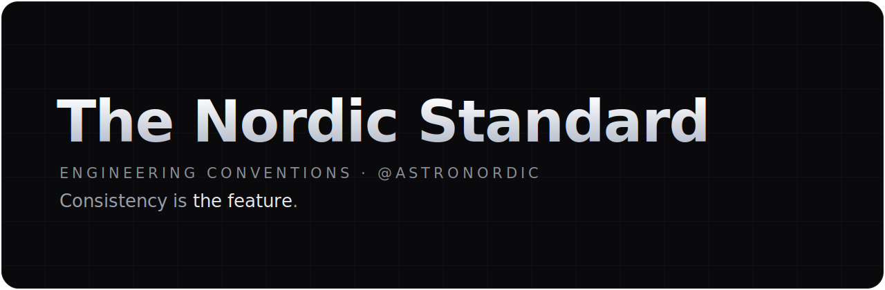

Default community health files · single source of truth for every @astronordic repo

---

This is a **special repository**. On GitHub, a public repository named `.github` provides
**default community health files** — `CONTRIBUTING`, `CODE_OF_CONDUCT`, `SECURITY`, issue and
pull-request templates — to every other repository on the account that doesn't define its own.

In other words: this repo is the **single source of truth**. Define a convention here once, and it
is followed everywhere. Individual repos may override a file when they genuinely need to.

## What lives here

| File | Purpose |
|------|---------|
| [`STANDARD.md`](./STANDARD.md) | The full engineering standard (language, commits, branches, READMEs, versioning, licensing) |
| [`CONTRIBUTING.md`](./CONTRIBUTING.md) | How to contribute across all repos |
| [`CODE_OF_CONDUCT.md`](./CODE_OF_CONDUCT.md) | Community expectations |
| [`SECURITY.md`](./SECURITY.md) | How to report a vulnerability |
| [`.github/ISSUE_TEMPLATE/`](./.github/ISSUE_TEMPLATE) | Bug report and feature request forms |
| [`.github/PULL_REQUEST_TEMPLATE.md`](./.github/PULL_REQUEST_TEMPLATE.md) | The PR checklist |
| [`templates/`](./templates) | Drop-in files: `LICENSE`, `.editorconfig`, CI workflows, Dependabot |

---

make it work → make it right → make it beautiful.

